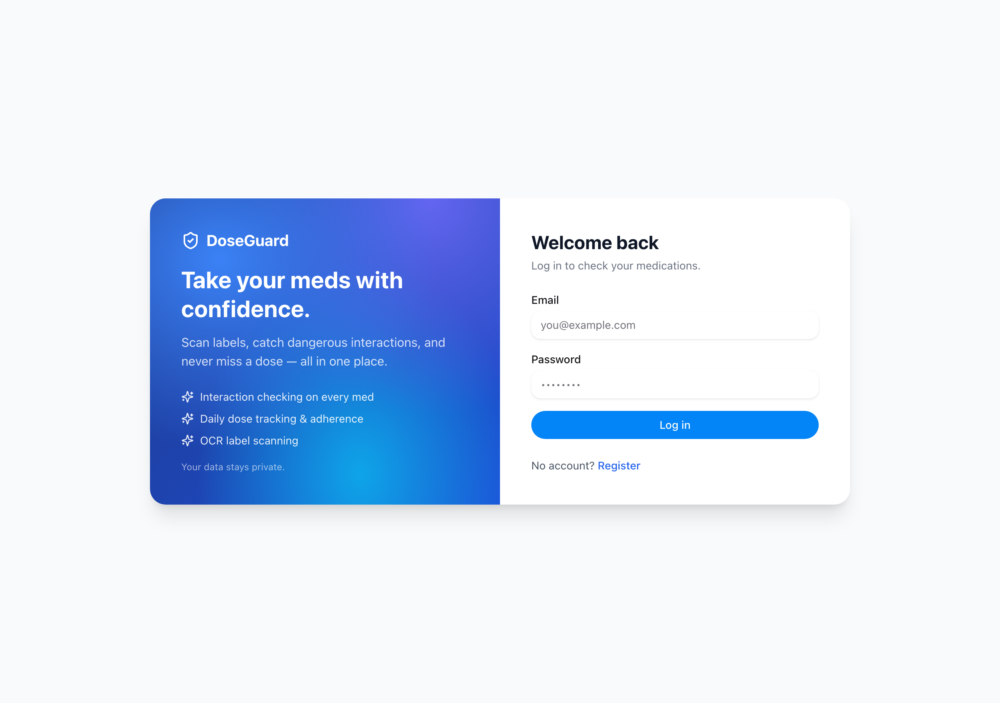
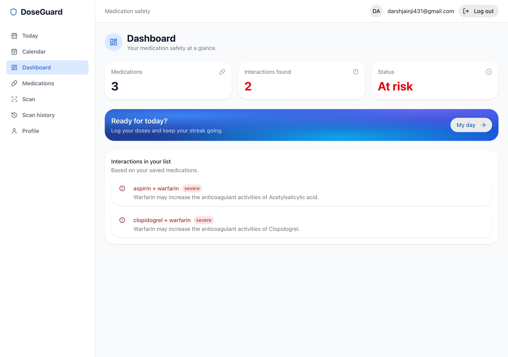
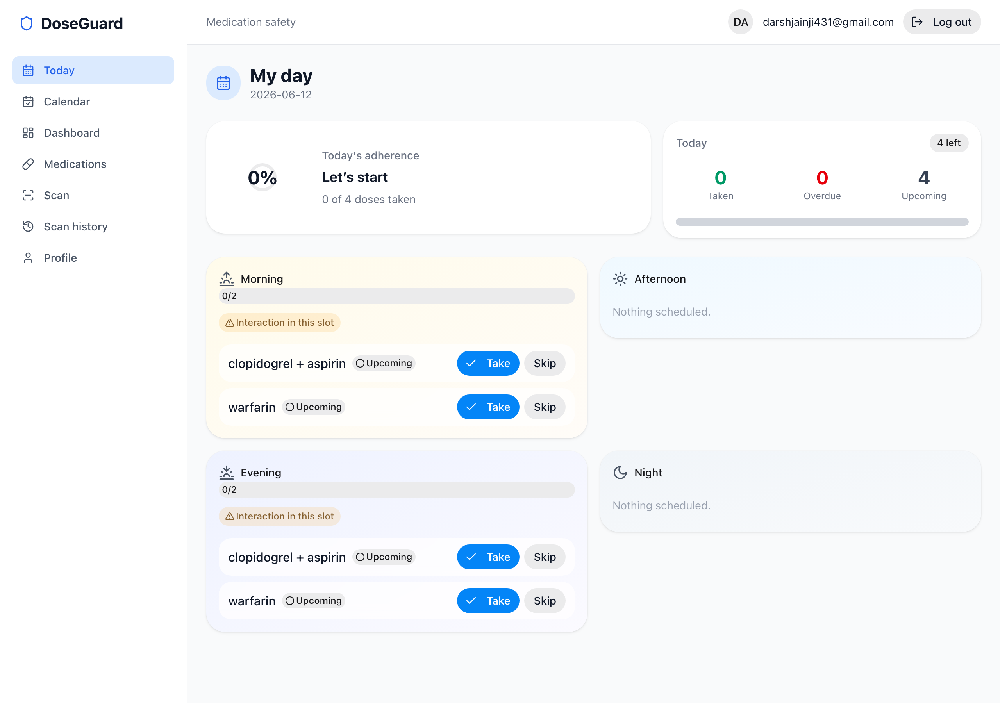
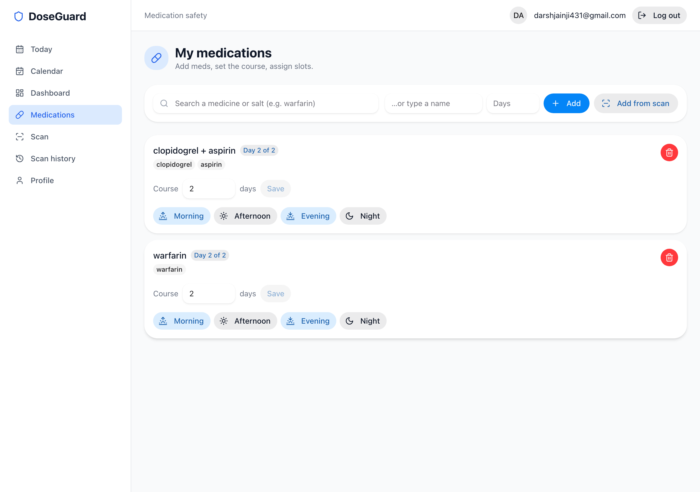
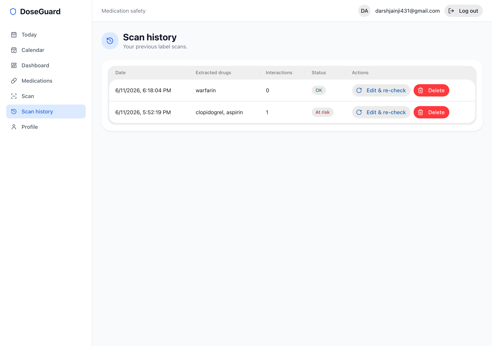
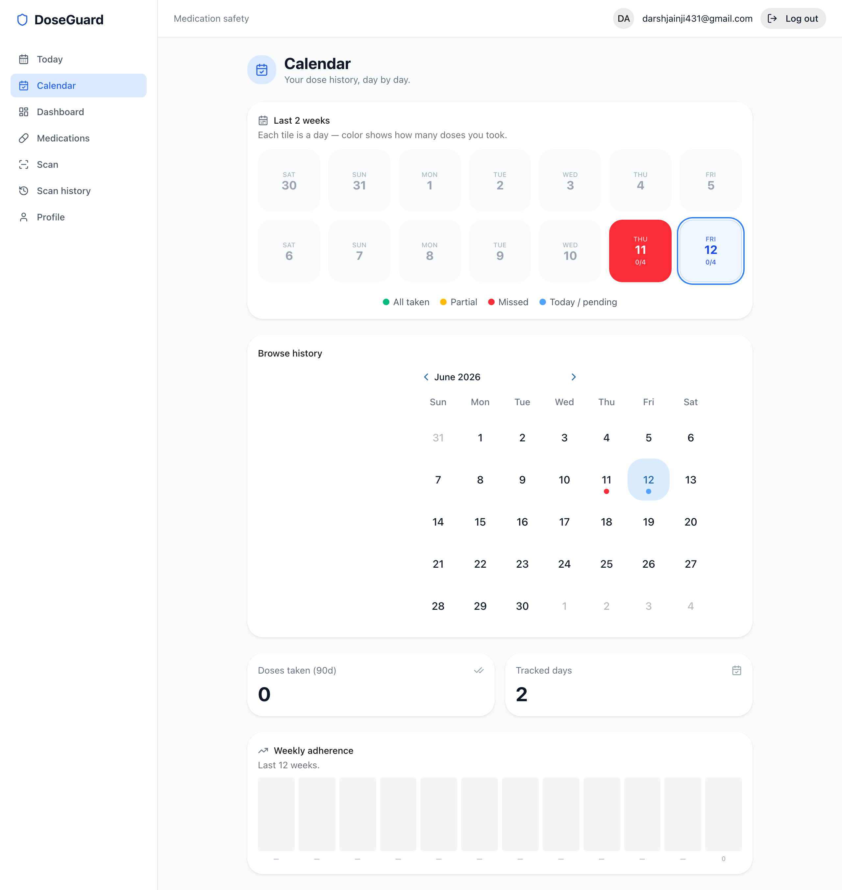
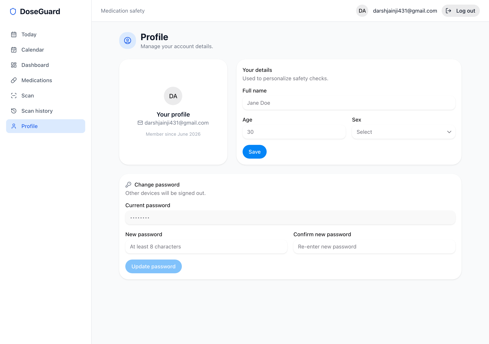

# DoseGuard

Point your phone at a strip of pills, and DoseGuard reads the label, figures out
what's actually in it, and tells you if it clashes with the other things you're
taking. It also keeps track of when you're supposed to take what.

The whole thing started because keeping a parent's prescriptions straight is
harder than it should be, and "is it safe to take these two together?" is a
question you shouldn't have to google at 11pm.

## Live demo

A preview instance is live at **https://cartridge-served-discounts-specific.trycloudflare.com**

Log in with the demo account:

| email | password |
|-------|----------|
| `darshjainji431@gmail.com` | `darshjain` |

It's served over HTTPS and works on both IPv4 and IPv6. The link is a temporary
preview tunnel, so it can change — grab the current one if it stops responding.

📹 **Walkthrough (~30s):** [docs/demo.mp4](docs/demo.mp4)

## Screenshots



And once you're in:

| | |
|---|---|
| **Dashboard** — interactions at a glance | **Today** — per-slot dose tracking |
|  |  |
| **Medications** | **Scan history** |
|  |  |
| **Calendar** | **Profile** |
|  |  |

## What it does

- **Scan a label.** Take or upload a photo and OCR pulls the text off it. We
  don't trust the raw text though, brand names get resolved to actual
  ingredients before anything else happens.
- **Check interactions.** Once it knows the ingredients, it checks every pair
  against a local interaction dataset (with a PubChem/RxNorm fallback for
  things we don't have). Severity is shown so a "moderate" doesn't look like a
  "don't do this".
- **Track doses.** Add your meds, set which slots you take them in
  (morning / afternoon / evening / night), and the "Today" view shows what's
  due, what's done, and what you've missed. There's a calendar and a rough
  adherence percentage too.

It leans toward Indian brand names since that's what it was built and tested
against, but the ingredient/interaction data is generic.

## How it's put together

It's a monorepo with two packages:

```
packages/
  api/    FastAPI backend (Python), SQLite, OCR + drug resolution
  web/    React + Vite frontend
```

**Backend** is FastAPI with SQLModel on top of SQLite. OCR is PaddleOCR.
Drug names get resolved through a local dataset first and fall back to the
RxNorm API; interactions come from a curated local table with a PubChem lookup
as backup. Auth is plain JWT (access + refresh) with bcrypt for passwords.

**Frontend** is React 19 + Vite, HeroUI components, Tailwind, and Framer Motion
for the bits of polish. Camera capture happens in the browser.

The drug/interaction dataset isn't magic, it's built by the scripts under
`packages/api/scripts/` (ingest from DDInter, PubChem enrichment, alias
matching, etc). The DB ships pre-built so you don't have to run those unless
you're rebuilding the data.

## Running it locally

You'll need Python 3.11+ and Node. The backend uses [uv](https://docs.astral.sh/uv/).

### API

```bash
cd packages/api
uv sync
uv run uvicorn app.main:app --reload
```

That serves on `http://localhost:8000`. The DB (`doseguard.db`) is created/
migrated on startup, so first run just works.

Config is read from env vars (all prefixed `DOSEGUARD_`) or a `.env` file in
`packages/api`. The defaults are fine for local dev. The ones worth knowing:

| var | default | notes |
|-----|---------|-------|
| `DOSEGUARD_SECRET_KEY` | a dev placeholder | **set a real one before deploying** — it's required in production |
| `DOSEGUARD_DATABASE_URL` | `sqlite:///./doseguard.db` | |
| `DOSEGUARD_CORS_ORIGINS` | `["http://localhost:5173"]` | where the frontend runs |
| `DOSEGUARD_PUBCHEM_LIVE` | `true` | set false to skip the network fallback |

Tests:

```bash
uv run pytest
```

### Web

```bash
cd packages/web
npm install
cp .env.example .env   # points at http://localhost:8000 by default
npm run dev
```

Vite serves on `http://localhost:5173`.

## A heads up

This is a personal project, not a medical device. The interaction data has gaps
and the OCR will occasionally misread a label, so treat the output as a prompt
to double-check with a pharmacist, not as the final word. Don't make dosing
decisions off it.

## License

See [LICENSE](LICENSE).
